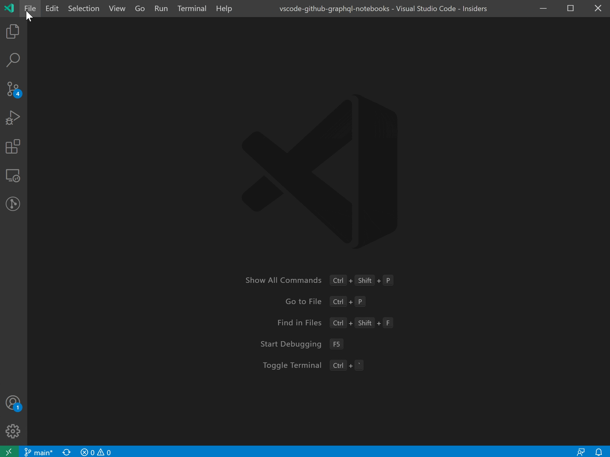

# GitHub GraphQL Notebooks

Interactively run [GitHub GraphQL](https://docs.github.com/en/graphql) queries and mutations right inside [VS Code notebooks](https://code.visualstudio.com/api/extension-guides/notebook)! 📓

Get started:
1. File > New File... > GitHub GraphQL Notebook
2. Sign into GitHub through the built-in GitHub Authentication extension when prompted
3. Run and save your queries and mutations
